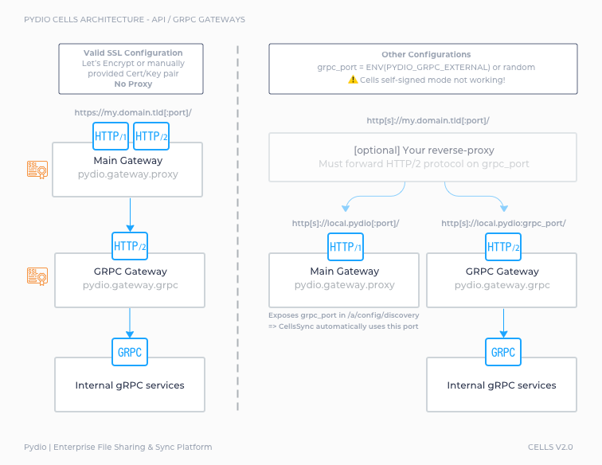
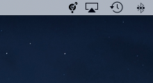
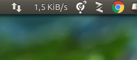
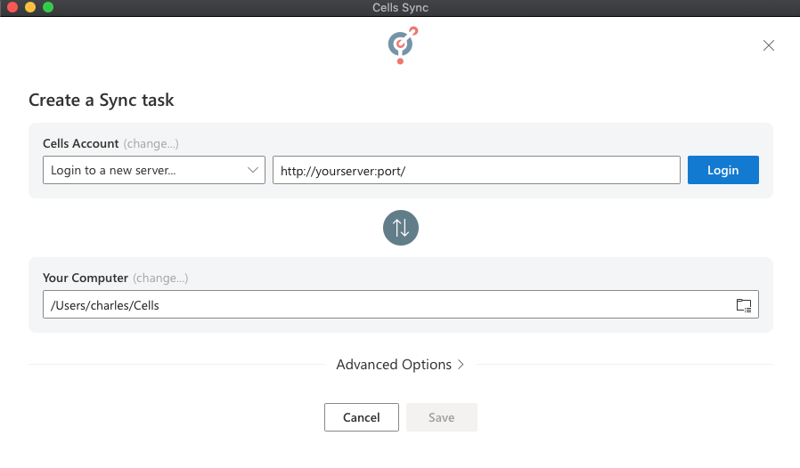
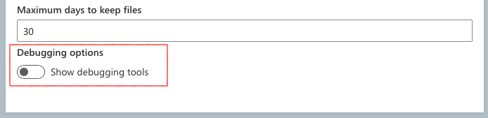
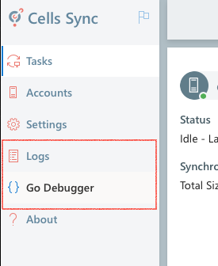

# Pydio Cells 2.0 Release Candidate

[TOC]

------

## A - Presentation

### What's new

This version provides a desktop sync client that replaces (at last) PydioSync for Cells. **CellsSync** provides offline synchronization on your Windows, Linux and Mac computers.

This is a major step in fulfilling the promise of the initial rewrite of Pydio in GO language, as CellsSync is written in the same language and shares most of its libraries with the server. For this reason, many server components where also extended under the hood. 

Below are the most important ones :

- **The "Sync" library**, that was used inside DataSources to mirror the *object service* modifications to the *index service* of each datasource was fully rewritten. This same library is used for server-to-desktop synchronization, and can even be used in other interesting scenariis : server-side folder-to-folder sync (directly through datasources), server-to-s3 storage sync (for realtime or scheduled backups), etc. 
- **The Authentication brick**, originaly based on Open ID Connect, has been greatly rethought to allow external applications to use the server as a standard OIDC Identity Provider. Typically, adding an account inside CellsSync opens a common OAuth2 workflow by opening the server login page and getting a token back to the application. CellsSync does not know anything about users credentials locally.

### Important! New gRPC gateway requirements

For best performances and real-time events, CellsSync communicates with the server using a gRPC connection. gRPC is an HTTP/2 protocol, and was already used internally for service-to-service communication. A new dedicated service (*pydio.gateway.grpc*) now proxies external gRPC calls to internal services. This new feature implies that **HTTP/2 must be enabled on the bind address facing the outside world**.

At the time being, this is managed differently depending on your Cells Server SSL configuration and reverse-proxy usage. A "valid SSL configuration" means <u>SSL Enabled with your own Cert/Key couple of via Let's Encrypt</u>. NoSSL or SelfSigned SSL cannot use that feature and will require more work:

- **[Valid SSL Configuration]** Cells internal proxy will serve HTTP/1.1 and HTTP/2 on the same port, the one you define for external url (e.g; 443, or 8080 or anything you choose). You don't have to open any other port in your firewall.
  - **[No Proxy]** Your Cells is directly facing the outside world with a proper SSL configuration, everything should be working out of the box
  - **[Proxy]** Make sure your proxy is HTTP/2 enabled
- **[No SSL]** Cells cannot serve HTTP/1.1 and HTTP/2 on the same port: service *pydio.gateway.grpc* will be directly connected to. By default, it picks a randomly available port and advertises it in the /a/config/discovery API. The CellsSync client will automagically query this API to connect. 
  - **[No firewall, No Proxy]** If you are on a local machine with all ports open, this should work out of the box.
  - **[Firewall and/or Proxy]** You will have to make proper configuration to open and forward the HTTP/2 on this port. To avoid using a random port at each restart, you can fix this port by using the **PYDIO_GRPC_EXTERNAL** environnement variable at startup. Please note that your proxy will probably not be able to serve HTTPS but HTTP only. 
- **[Self-Signed]** The current "self signed" setup of Cells cannot share the in-memory generated Certificates between cells main proxy and the new gRPC gateway. At the moment this setup is not supported. To achieve a similar setup, you should generate your own self signed keypair using https://github.com/FiloSottile/mkcert, and configure them as a Cert/Key configuration in Cells, going back to first case "Valid SSL Configuration".

The various cases are summarized in the figure below.

------

## B - Install / Run instructions

### Cells Server

Cells 2.0 does not have any new parameters for installation, and the required configuration changes should be applied automatically if you are replacing the binary of an existing Cells 1.X installation. As such, please refer to the official Cells documentation for installation instructions.

On a fresh install, the "Personal Files" workspace will be sync-enabled by default. If you are upgrading, make sure to enable one of your workspaces to allow synchronization, otherwise you will not see any resources when browsing the server from within Cells Sync. 

##### In-App Update

Update can be performed from a running Cells 1.X by using the in-app update tool. Just switch the update config to the `dev` channel and click refresh to see the new version appear, perform the update and restart. You should be good to go.

##### Fresh Install

Binaries are available for all OS on our download server : 

Linux: https://download.pydio.com/pub/cells/release/2.0.0-rc1/linux-amd64/cells

MacOSX: https://download.pydio.com/pub/cells/release/2.0.0-rc1/darwin-amd64/cells

Windows : https://download.pydio.com/pub/cells/release/2.0.0-rc1/windows-amd64/cells.exe

### CellsSync

CellsSync is available for Windows, MacOS and Linux with installers in the following formats

- **Windows signed MSI** : will install cells-sync.exe in your local Program Files. Switching on the "Run At Startup" configuration should create a "*.lnk*" shortcut inside the Windows Start Up menu.
  Download URL : https://download.pydio.com/pub/cells-sync/release/0.8.0/windows-amd64/CellsSync-0.8.0.msi

- **MacOS signed DMG** provides a drag'n'drop Finder window for installing cells-sync in your Applications folder. Switching on the "Run At Startup" should install CellsSync as a *launchd service* in the user scope (under `~/Library/LaunchAgents`)
  Download URL : https://download.pydio.com/pub/cells-sync/release/0.8.0/darwin-amd64/CellsSync-0.8.0.dmg

- **Linux Binary**  : The "Run At Startup" option is ubuntu-specific and installs "*.desktop*" shortcuts in the required locations. We are working on providing a SNAP for installing more easily no desktop-enable linux distributions.
  Download URL : https://download.pydio.com/pub/cells-sync/release/0.8.0/linux-amd64/cells-sync

Once installed, you should find a new icon in your Systrem Tray. 

| Windows                                  | MacOSX                           | Linux                                |
| ---------------------------------------- | -------------------------------- | ------------------------------------ |
|  |  |  |

At first run, the application interface (webview) will open automatically on the "Create Task" screen. You should be able to create a new server with your Cells 2.0 server URL and be redirected back and from the server for identifying your user. 

After authentication completes, you should see the new server in the "Cells Account" list, and then click in the "Path" to select a workspace or a subfolder to sync (make sure to make one workspace sync-able as explained above.)

Select the target Path for the local folder (a default location should be created automatically) and save the task. Sync should be on its way!

------

## C - CellsSync Known Issues

- On MacOS, once enabled, you cannot disable the "Run At Startup" option from the app. You have to remove the service by running `/Applications/CellsSync/Contents/MacOS/cells-sync service uninstall`command.
- Conflicts (parallel modifications of a same file on both endpoints) may still be buggy
- The "Stop" button is sometimes not working as it should
- MacOS ".keynote" files may be buggy as well, especially if you are migrating them from an old version of Keynote (stored as a folder) to a newer version (stored as file). Saving the file to a new name should make the process easier.

------

## D - Testing instructions

The Sync library has been already thoroughly tested, especially with a big amount of files and folders. But of course there might still be some glitches. Please make sure to backup everything before starting syncing! We don't want you to loose any data...

### CellsServer

As before, the logs are located under %APPLICATION_DATA%/logs. 

- On windows, %APPLICATION_DATA% = `C:\Users\%username%\AppData\Roaming\Pydio\cells`
- On Linux %APPLICATION_DATA% = `/home/%username%/.config/pydio/cells`
- On Mac %APPLICATION_DATA% = `/Users/%username%/Library/Application Support/Pydio/cell`s

Please send us the log along with all info you can gather on your system in case of bugs. 

### CellsSync

Same as Cells server, the logs are located under %APPLICATION_DATA%/logs. 

- On windows, %APPLICATION_DATA% = `C:\Users\%username%\AppData\Roaming\Pydio\cells-sync`
- On Linux %APPLICATION_DATA% = `/home/%username%/.config/pydio/cells-sync`
- On Mac %APPLICATION_DATA% = `/Users/%username%/Library/Application Support/Pydio/cells-sync`

For testing, it can be helpfull to enable the debugging tools inside the CellsSync settings. 

This will add two more entries in the menu : a log viewer for directly show application logs, and a GO debugger for showing various states of the program. The latter is particularly usefull if you feel that the application is "stuck" in a state where nothing more happens : open the Go debugger and please send us the "goroutines" list that you see in there.

